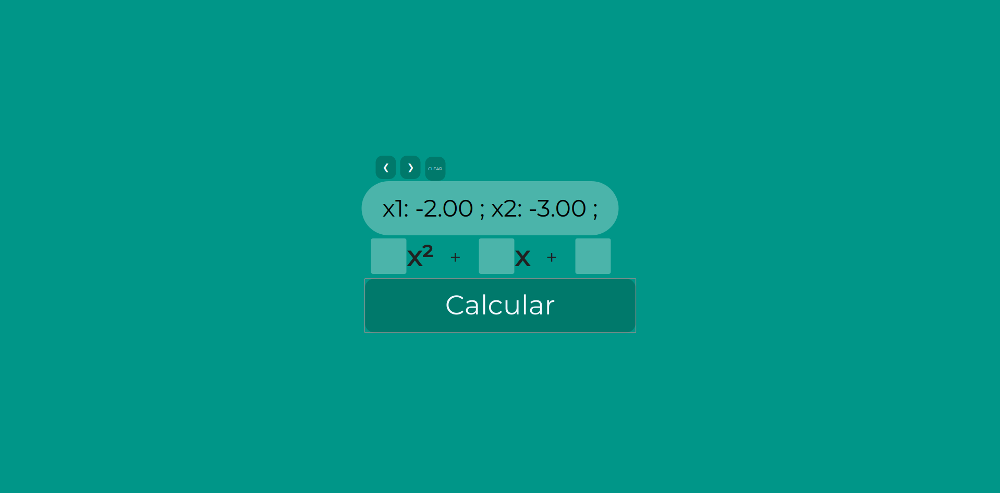
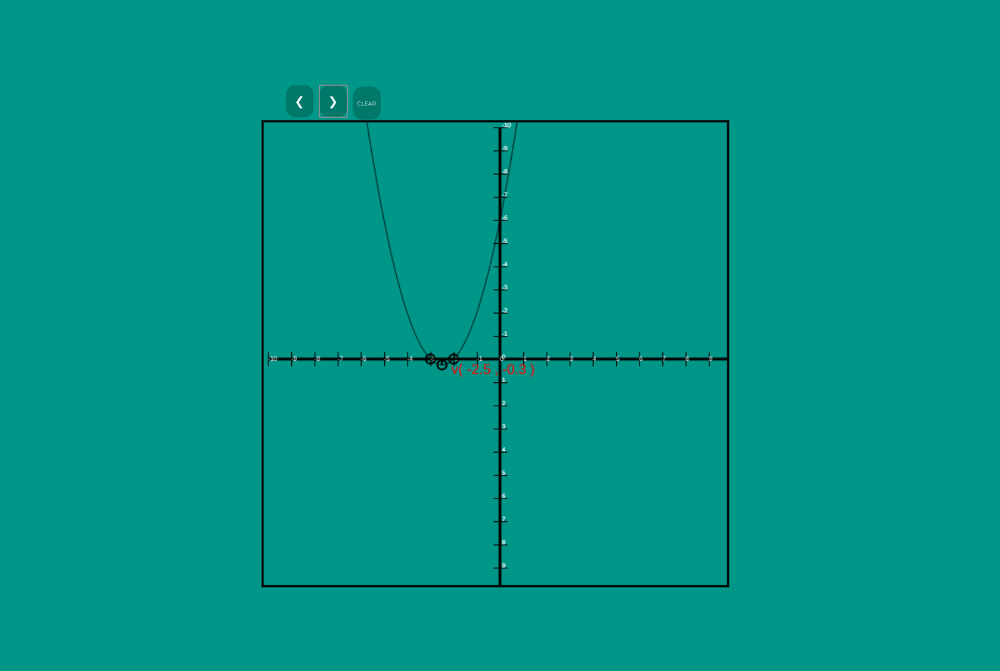
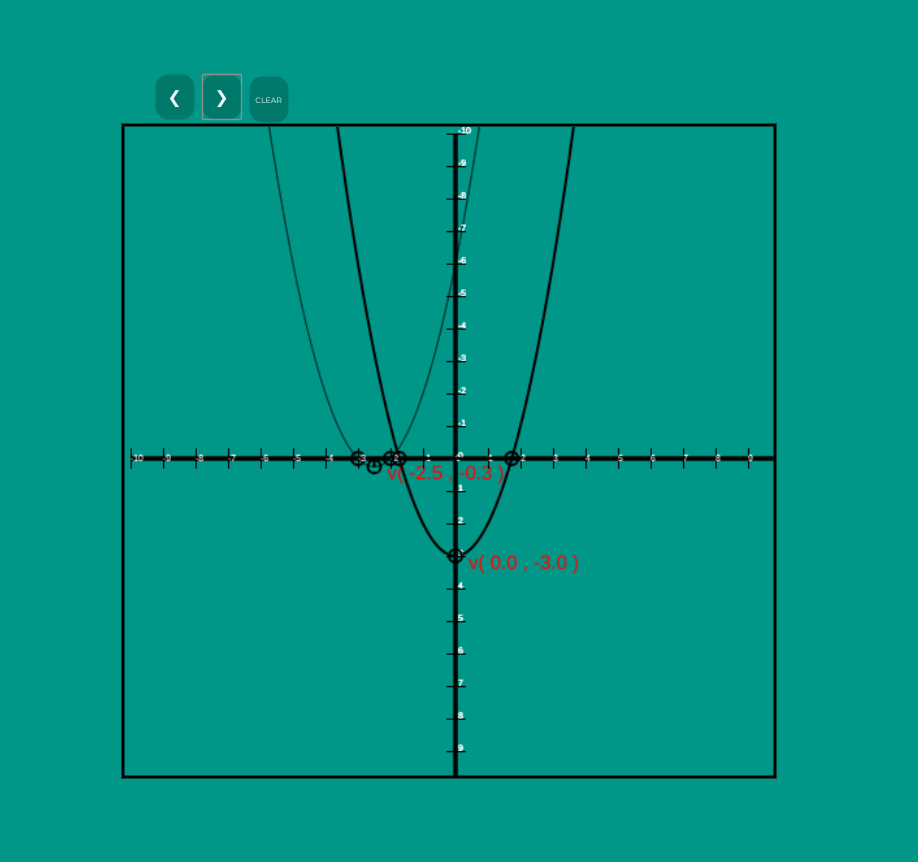

# Função Quadratica

https://funcao-quadratica.netlify.com/

## Trabalho de desenolvimento Web. CEFET-RJ

Utilizando JavaScript, HTML, CSS. 
Manipulação do DOM e animações no Canvas.

### Prof. Renato ---- 3Binfo

